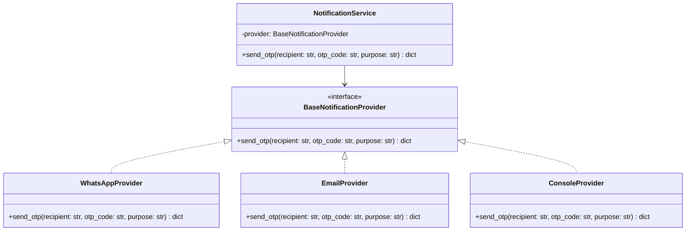
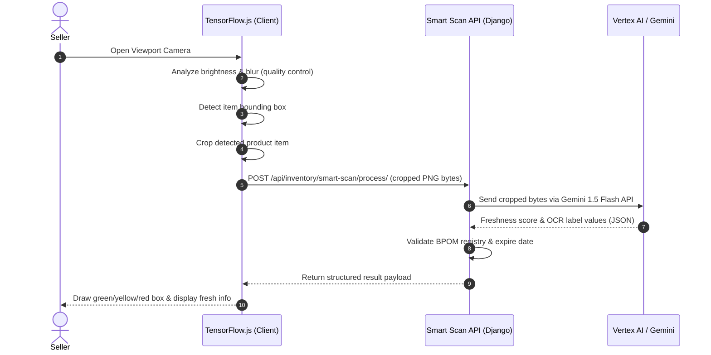

# Warungio Engineering Architecture Log

This document defines the custom architectural decisions, service designs, and rationales for the Warungio Marketplace development, ensuring adherence to production-grade security, scalability, and loose coupling.

---

## 1. Provider-Agnostic Notification Service

### Design Goal
We must decouple the authentication OTP views from the delivery channels (WhatsApp, Email, SMS). This isolates downstream carrier API integrations and enables runtime switching or falling back between providers.

### Architecture Schema

### Rationale
- **Decoupled Business Logic**: Adding a new SMS gateway (e.g. Twilio, Wavcell) only requires writing a new class implementing `BaseNotificationProvider`. The views in `accounts/views.py` remain unchanged.
- **Failover Chain**: If the WhatsApp gateway fails (non-200 response), the service automatically executes the fallback chain to dispatch the OTP via Email.
- **Mock Safety**: Under `settings.DEBUG = True`, the system defaults to `ConsoleProvider`, printing raw codes to std_out and preventing unnecessary billing during testing.

---

## 2. Hybrid AI Smart Scan Architecture

### Design Goal
We must implement a high-efficiency visual evaluation that avoids overloading backend servers with raw WebRTC video feeds while keeping sensitive freshness scoring and Expiry/BPOM OCR calculations secure on the server.

### Pipeline Flow

### Rationale
- **Bandwidth Reduction**: Transmitting only the cropped bounding box (often $< 100\text{KB}$) instead of full high-resolution video frames ($> 3\text{MB}$) saves mobile data and lowers API latency.
- **Edge Validation**: Checking blur and lighting on the client prevents invalid images from reaching the API, reducing billing charges on Google Cloud/Vertex AI API calls.

---

## 3. Hyperlocal Administrative Address Routing

### Design Goal
To execute hyperlocal shopping, we require complete geographical hierarchies matching official Indonesian Kemendagri codes.

### Hierarchy & Geo-Mapping
- **Hierarchy**: Province (2 chars) $\rightarrow$ Regency (4 chars) $\rightarrow$ District (6 chars) $\rightarrow$ Village (10 chars).
- **Coordinates**: Stores and buyer addresses map to Latitude/Longitude coordinate centroids.
- **Shipping Costs**: The checkout API calculates geodesic distance between the buyer's shipping address village and the store location using the Haversine formula:
  $$d = 2r \arcsin\left(\sqrt{\sin^2\left(\frac{\Delta\phi}{2}\right) + \cos(\phi_1)\cos(\phi_2)\sin^2\left(\frac{\Delta\lambda}{2}\right)}\right)$$
  Shipping costs are computed dynamically based on distance bands (e.g., Rp2,500 per km).
